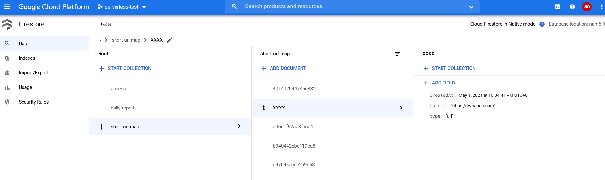

# Short url cloud function

GCP cloud function, it's have two major features: Register and Redirect.  
Register: Store new url to server, and return short url  
Redirect: Direct user to other site with short url path which from Register  

They will be deployed to separate functions.  

## Services

### Firestore

This project have uses Firestore, so should be execute Firestore service.  

Schema:  
  


## Environments

### Register

* REDISHOST: redis host
* REDISPORT: redis port
* SHORTURLBASE: Redirect function url

### Redirect

* REDISHOST: redis host
* REDISPORT: redis port

### Deploy

Modify makefile deploy value  

```makefile
# GCP cloud function deploy
CONNECTOR = projects/serverless-test-XXXXX/locations/us-central1/connectors/serverless-connector
REGION = us-central1
REDISHOST = 10.0.0.1
REDISPORT = 6379
SHORTURLBASE = https://us-central1-serverless-test-XXXXX.cloudfunctions.net/Redirect/
PROJECTID = serverless-test-XXXXX
ISONGCP = True
```

```cmd
$ make deploy_register
$ make deploy_redirect
```

### Test

```cmd
$ make test
```

#### Node

Currently test will failed: `Redirect key not exist: read tcp 127.0.0.1:62178->127.0.0.1:62177: wsarecv: An established connection was aborted by the software in your host machine.`, Maybe miniredis call too more times during testing.
