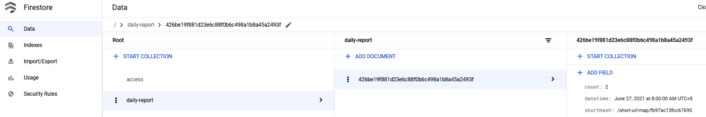

# Short url source cloud function

GCP cloud function, it's will store access log to firestore

## Services

### Firestore

This project have uses Firestore, so should be execute Firestore service.  

Schema:  
  
  

## Environments
### Deploy

Modify makefile deploy value  

```makefile
# GCP cloud function deploy
PROJECTID = serverless-test-XXXXX
CONNECTOR = projects/$(PROJECTID)/locations/us-central1/connectors/serverless-connector
REGION = us-central1
TOPICID = short-url-source-topic
```

```cmd
$ make deploy
```
